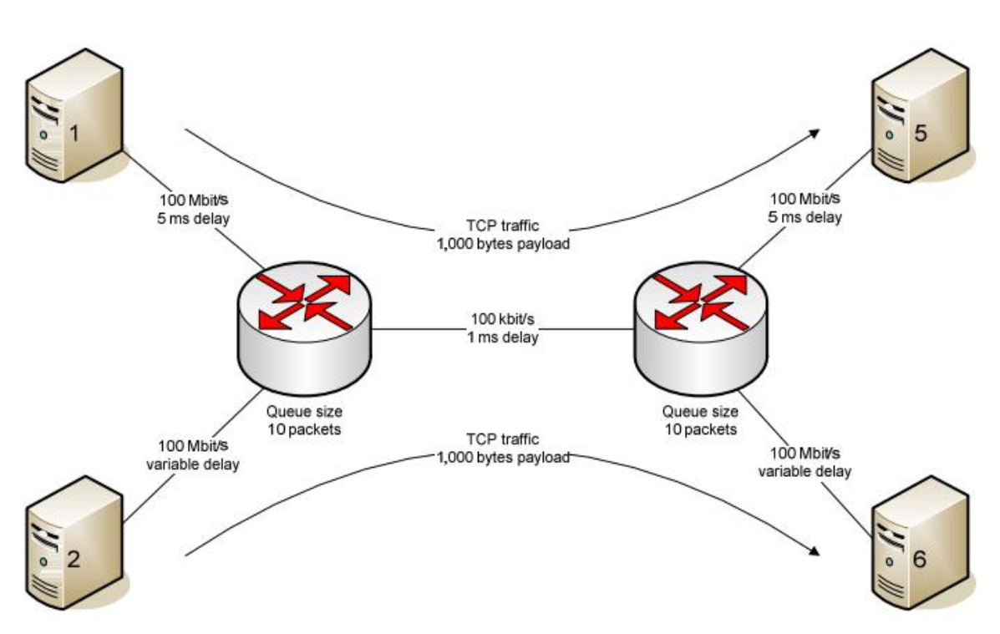

# TCP Congestion Control Analysis

This repository contains an analysis of TCP congestion control algorithms including Newreno, Tahoe, and Vegas using NS2.

## Project Description

We have simulated a network with a specific topology and observed the following factors:

- Changes in congestion window size
- Goodput rate
- Packet loss rate
- Round-trip time rate

## Network Topology

The network topology used for this simulation is as follows:

## Network Conditions

The following conditions hold for the network at all times:

- The flow from node 1 to 5 and 2 to 6 is constant.
- Queue size in all routers equals to 10 packets.
- TTL (Time To Live) is always equal to 64.
- Network capacity is considered to be constant. Packet size is equal to the default size in NS2 which is 1000 bytes. The protocol used is IPV4.
- For variables such as initial window size, maximum window size, etc., default values of NS2 are used.
